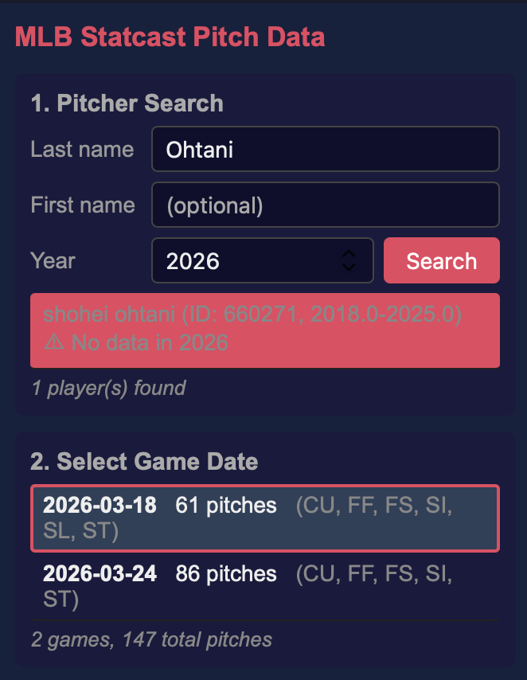
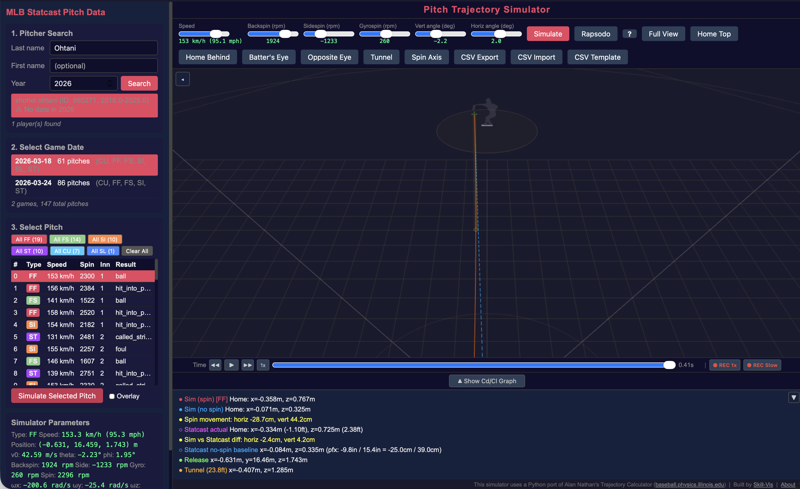

## Step 1: Open the Simulator

Go to **[baseball.skill-vis.com](https://baseball.skill-vis.com)**. The simulator runs entirely in your browser — nothing to install.

## Step 2: Search for a Pitcher

In the left panel, type a pitcher's name (e.g., **"Ohtani"**) in the search box and press Enter. Select the pitcher from the results.

{fig-alt="Pitcher search showing Ohtani results" width="350px"}

## Step 3: Pick a Game

A list of game dates appears. Each entry shows the date, number of pitches, and pitch types thrown. Click a game to load its pitches.

{fig-alt="Game dates and pitch list with type filter buttons" width="300px"}

## Step 4: Pick a Pitch

The pitch list shows every pitch from that game. Each row shows:

- **Pitch type** — color-coded badge
  (FF = four-seam,
   SL = slider, etc.)
- **Speed** (mph)
- **Spin rate** (rpm)

Click a pitch, then click **Simulate**.

## Step 5: Watch the Trajectory

{fig-alt="Full simulator view showing trajectory, parameters, and markers"}

The 3D view shows:

- **Orange line** — the ball's actual path (with spin effects)
- **Gray line** — where the ball would go with **no spin** (gravity only)
- **Gap between the two** — this is the **movement** created by spin
- **Animated baseball** — rotating at the real spin rate, with the spin axis arrow

Drag to rotate the view. Scroll to zoom.

## Step 6: Try Batter's Eye

Click the **Batter's Eye** button in the toolbar. The camera moves to the batter's box, showing you the pitch from the hitter's perspective. You can toggle between **Track: Ball** (camera follows the ball) and **Track: Pitcher** (camera stays fixed).

## What's Next?

- **Compare two pitches**: Turn on **Overlay** mode, simulate a second pitch, and see both trajectories stacked
- **Try different pitch types**: Use the filter buttons (FF, SL, CH, etc.) above the pitch list
- **Enter your own data**: Switch to [Manual Input](guides/manual-mode.qmd) or [Rapsodo Input](guides/rapsodo-mode.qmd)
- **Understand the physics**: Read [Spin & Movement](concepts/spin-and-movement.qmd) to learn what backspin, sidespin, and gyrospin mean for pitch design
