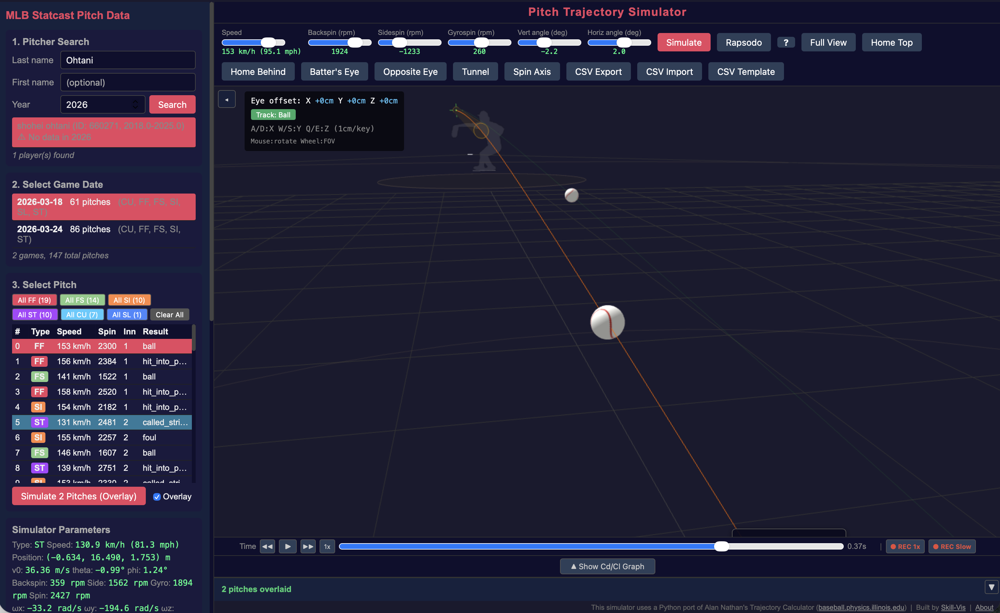

## Overview

Batter's Eye places the camera at the batter's eye position in the batter's box. You see the pitch coming toward you — just as the hitter does.

## Activating Batter's Eye

Click one of two buttons in the toolbar:

| Button | Description |
|--------|-------------|
| **Batter's Eye** | View from the batter's box matching the current batter's handedness |
| **Opposite Eye** | View from the opposite batter's box |

The camera moves to the batter's eye position. The 3D batter figure hides so it doesn't block your view.

{fig-alt="First-person view from the batter's box showing an incoming pitch"}

## Camera Position

The eye position is determined by:

- **X (lateral)**: ±0.65 m from center, based on batter handedness (R = right box, L = left box)
- **Y (depth)**: 0.216 m behind home plate
- **Z (height)**: When Statcast data is available, the height is set to **sz_top + 0.3 m** (strike zone top + 30 cm). Without Statcast data, it defaults to 1.45 m (batter model head height).

## Controls in First-Person Mode

### Looking Around

- **Mouse drag** — rotate your view (turn your head)
- **Scroll wheel** — adjust field of view (FOV)

### Moving Position

You can fine-tune the eye position with keyboard controls:

| Key | Direction | Amount |
|-----|-----------|--------|
| **W** | Forward (toward pitcher) | 1 cm |
| **S** | Backward (toward catcher) | 1 cm |
| **A** | Left (toward 1st base) | 1 cm |
| **D** | Right (toward 3rd base) | 1 cm |
| **E** | Up | 1 cm |
| **Q** | Down | 1 cm |

The offset from the original position is displayed in the top-left overlay:

```
Eye offset: X +3cm  Y -1cm  Z +2cm
```

### Ball Tracking

| Mode | Description |
|------|-------------|
| **Track: Ball** (default) | Camera automatically follows the ball during playback |
| **Track: Pitcher** | Camera stays fixed, looking toward the mound |

Click the toggle button in the overlay to switch.

## Best Uses

### Tunnel evaluation
Enable overlay, simulate a fastball and a changeup, then switch to Batter's Eye. Play the animation and watch both balls approach. If you can't tell them apart until the last moment, the tunnel is effective.

### Pitch recognition training
Watch a pitch in Batter's Eye mode at slow speed (use frame stepping with ← → keys). Notice when you can first see the difference between a fastball and a slider.

### Video export
Record the Batter's Eye view as MP4 with the **REC Slow** button. Share the video to show what the batter sees.

::: {.callout-tip}
## Combine with Spin Axis

Enable the **Spin Axis** button while in Batter's Eye. You'll see the spin axis arrow on the approaching ball — this is the visual cue that elite hitters use to identify pitch type.
:::
