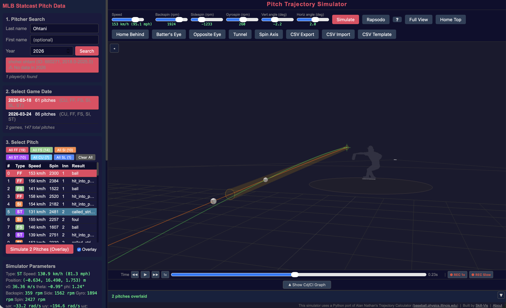

## Overview

The Tunnel feature shows where each pitch crosses the 23.8-ft decision point — the last moment the batter can change their swing decision.

## Turning On the Tunnel

Click the **Tunnel** button in the toolbar. It toggles on/off (green = on).

## What You See

{fig-alt="Tunnel visualization with two overlaid pitches and yellow tunnel cylinder"}

When Tunnel is enabled, the 3D view shows:

- **Yellow rings** — one at the release point and one at the 23.8-ft crossing point
- **Transparent yellow cylinder** — connecting the two points, showing the "tunnel" corridor

When you overlay multiple pitches, each pitch gets its own tunnel cylinder. If the 23.8-ft rings overlap, those pitches tunnel well.

## Reading the Tunnel Data

The left panel shows the tunnel crossing coordinates:

```
● Tunnel (23.8ft) x=-0.404m, z=1.410m
```

This is the ball's position when it crosses the 23.8-ft plane. Compare these coordinates across overlaid pitches — the closer they are, the better the tunnel.

## Tunnel + Overlay: A Practical Example

### Ohtani's FF vs ST (2026-03-24)

1. Search "Ohtani", select 2026-03-24
2. Select pitch **#7** (FF, 97 mph) — Simulate with Overlay checked
3. Select pitch **#83** (ST, 81 mph) — Simulate
4. Enable **Tunnel**

These two pitches have a release angle difference of only 0.234°. Despite a 16 mph speed difference, they pass through nearly the same point at 23.8 ft.

### Senga's FF vs FO (2026-03-19)

1. Search "Senga", select 2026-03-19
2. Select pitch **#54** (FF, 95 mph) — Simulate with Overlay
3. Select pitch **#30** (FO, 87 mph) — Simulate
4. Enable **Tunnel** and **Batter's Eye**

Release angle difference: only 0.095°. The forkball ("ghost fork") looks identical to the fastball at the decision point.

## Tips

- The tunnel visualization works in **all view modes** including Batter's Eye
- Use **frame stepping** (← → keys) to pause the animation at exactly the tunnel crossing point
- The tunnel cylinder radius is approximately 2× the ball diameter — representing the area where the batter cannot reliably distinguish between pitches
