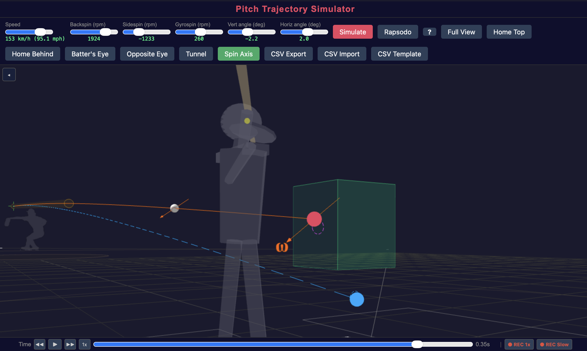

## ひとことで言うと

**回転がボールを動かす。** 回転の方向と量によって、投球が「ノビる」のか、横に滑るのか、落ちるのか、カットするのかが決まります。

## 回転の3つの成分

すべての投球の回転は3つの成分に分解できます。3つの独立したダイヤルで、3つの異なる効果を制御していると考えてください。

### Backspin（バックスピン） — 「ノビ」のダイヤル

バックスピンは、フォーシームで見られる回転です。ボールの上面が進行方向と逆に回転します。

**効果:** 重力に抗う上向きの力（マグナス力）を生みます。実際にボールは上昇しません — ただ *打者の予想より落ちない* だけです。高回転のストレートが「ホップする」「ノビがある」と感じられるのはこのためです。

**典型的な値：**

| 球種 | Backspin | 効果 |
|-----------|---------|--------|
| フォーシーム | 1800〜2500 rpm | 強い「ノビ」、ボールが沈みにくい |
| カーブ | −1500〜−2500 rpm | 負のバックスピン = トップスピン = 余分な落下 |
| チェンジアップ | 1200〜1600 rpm | ストレートよりノビが少ない → より落ちる |

### Sidespin（サイドスピン） — 「横変化」のダイヤル

サイドスピンは、ボールを左右に動かす回転です。

**効果:** 水平方向の力を生みます。スライダーの横変化は、ほぼすべてサイドスピンによるものです。カーブはトップスピン（負のバックスピン）とサイドスピンを組み合わせて、斜め方向の変化を生みます。

**典型的な値：**

| 球種 | Sidespin | 効果 |
|-----------|---------|--------|
| スライダー | 1500〜2500 rpm | 強い横変化 |
| カーブ | 500〜1500 rpm | トップスピンと合わせて斜めの変化 |
| フォーシーム | 0〜500 rpm | わずかなシュート成分 |

### Gyrospin（ジャイロスピン） — 「弾丸」のダイヤル

ジャイロスピンは、進行方向を軸とした回転です — フットボールのスパイラルやライフル弾のようなものです。

**効果:** 変化という点では、何も起きません。ジャイロスピンはボールに力を与えません。総回転数2500 rpmでもジャイロスピンが50%なら、有効回転はわずか1250 rpmの投球と同じ変化量になります。

**なぜ重要か:** 回転数だけでは投球の変化量はわかりません。**Spin efficiency**（回転効率） — バックスピン + サイドスピン（ジャイロスピンではない部分）の割合 — が変化量を決定します。

::: {.callout-tip}
## シミュレータで確認できます

シミュレータでは、**オレンジの軌道**が回転効果込みの軌道です。**グレーの軌道**は回転なし（重力のみ）を示します。両者の間隔がそのまま変化量です。

2つの球種をオーバーレイすると、軌道がどこで分岐するか — そして打者がその違いを認識するのに十分な時間があるかどうかが、はっきりわかります。
:::

## シミュレータで回転を見る

{fig-alt="回転軸の矢印と縫い目テクスチャの野球ボールのクローズアップ"}

シミュレータのアニメーションボールは、投球の実際の角速度で回転します。ボールに付いた矢印が回転軸を示します：

- **矢印が上向き** → 主にバックスピン（フォーシーム）
- **矢印が横向き** → 主にサイドスピン（スライダー）
- **矢印が前方向き** → 主にジャイロスピン（ジャイロスライダー、弾丸回転）

## Spin Efficiency（回転効率）

Spin efficiencyの定義はシンプルです：

> **Spin efficiency = 有効回転 / 総回転**

有効回転 = バックスピン + サイドスピン（実際にボールを動かす成分）。

フォーシームのSpin efficiencyは通常90〜100%。ジャイロスライダーは30〜50%程度 — 速く回転していますが、その多くがジャイロスピンとして「無駄」になっています。

::: {.callout-note collapse="true" title="技術的な補足：回転分解（BSG）"}

回転軸はNathanモデルにおいて、**B**ackspin、**S**idespin、**G**yrospin（BSG分解）の3成分で記述されます。

角速度ベクトル $(\omega_x, \omega_y, \omega_z)$ と速度方向が与えられたとき、BSG成分は $\omega$ を速度ベクトルに対して分解することで得られます：

- **G**（ジャイロスピン）: $\omega$ の速度方向成分
- **B**（バックスピン）: 速度に垂直な水平成分
- **S**（サイドスピン）: 残りの成分

注意：BとSの軸は互いに直交していますが、どちらもGに対して正確には直交しません。BSG座標系は直交基底ではなく、**斜交基底**です。

:::
