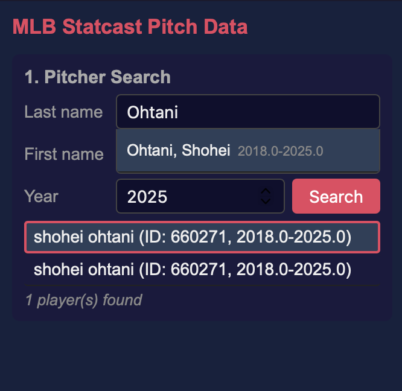

## ステップ1: シミュレータを開く

**[baseball.skill-vis.com](https://baseball.skill-vis.com)** にアクセスします。ブラウザ上で動作するので、インストールは不要です。

## ステップ2: 投手を検索する

左パネルの検索ボックスに投手の名前（例: **"Ohtani"**）を入力してEnterを押します。候補から投手を選択します。

{fig-alt="Ohtaniの検索結果" width="350px"}

## ステップ3: 試合を選ぶ

試合日の一覧が表示されます。各エントリには日付、投球数、使用した球種が表示されます。試合をクリックすると投球リストが読み込まれます。

{fig-alt="試合日と球種フィルタボタン付き投球リスト" width="300px"}

## ステップ4: 投球を選ぶ

投球リストにはその試合のすべての投球が表示されます。各行には：

- **球種** — カラーコード付きバッジ
  （FF = フォーシーム、
   SL = スライダー など）
- **球速**（km/h）
- **回転数**（rpm）

投球をクリックし、**Simulate** を押します。

## ステップ5: 軌道を見る

{fig-alt="軌道、パラメータ、マーカーを表示したシミュレータ画面"}

3Dビューに表示されるもの：

- **オレンジの線** — スピン効果を含む実際の軌道
- **灰色の線** — スピンなし（重力のみ）の場合の軌道
- **2本の線の間** — これがスピンによる**変化量**
- **アニメーションする野球** — 実際の回転数で回転し、スピン軸の矢印付き

ドラッグで視点を回転、スクロールでズームできます。

## ステップ6: バッター視点を試す

ツールバーの **Batter's Eye** ボタンをクリックします。カメラがバッターボックスに移動し、打者の視点から投球を見ることができます。**Track: Ball**（カメラがボールを追従）と **Track: Pitcher**（カメラ固定）を切り替えられます。

## 次のステップ

- **2球を比較**: **Overlay** モードをONにして、2球目をシミュレートすると軌道が重なって表示されます
- **球種を絞り込む**: 投球リスト上のフィルタボタン（FF, SL, CH等）を使います
- **自分のデータを入力**: [手動入力](guides/manual-mode.qmd) または [Rapsodo入力](guides/rapsodo-mode.qmd) に切り替え
- **物理を理解する**: [スピンと変化](concepts/spin-and-movement.qmd) でバックスピン、サイドスピン、ジャイロスピンの意味を学ぶ
