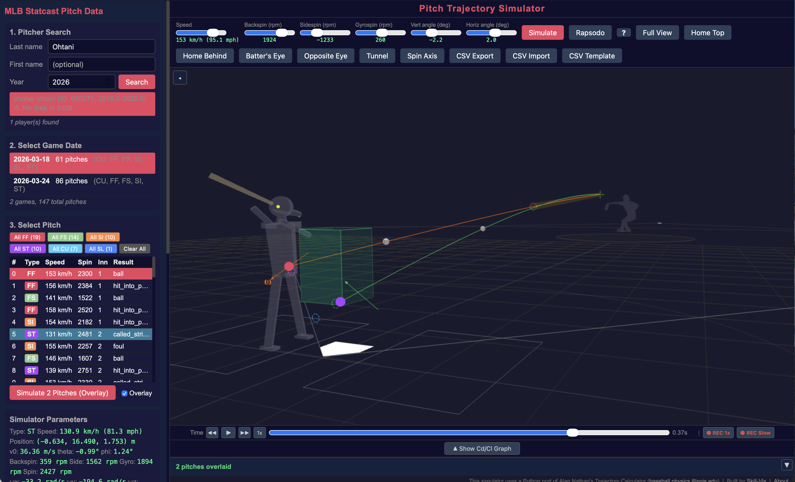

## 概要

Overlayモードでは、複数の投球をシミュレーションして軌道を同時に表示できます。投球比較の中核となる機能で、トンネル分析、球種設計の評価、一貫性のチェックに使えます。

## Overlayをオンにする

Simulateボタンの隣にある**Overlay**チェックボックスをオンにします。有効にすると：

- **最初の**投球はビューをクリアして通常通り描画
- **2球目以降**は別の色で軌道が追加表示されます

{fig-alt="2つの投球軌道のオーバーレイ比較"}

## 複数投球の一括選択

試合の投球リスト表示中に、複数の投球を選択できます：

| 操作 | 効果 |
|--------|--------|
| **Cmd/Ctrl + クリック** | 個別の投球をオン/オフ切り替え |
| **Shift + クリック** | 範囲選択 |
| **"All FF (12)"** ボタン | その球種をすべて選択 |
| **"Clear All"** ボタン | すべての選択を解除 |

複数の投球が選択されると、Simulateボタンが **"Simulate N Pitches (Overlay)"** に変わります。クリックすると、選択されたすべての投球が順次シミュレーションされ、自動的にオーバーレイ表示されます。

::: {.callout-warning}
30球以上を選択すると確認ダイアログが表示されます。各投球にAPIコールが必要なため、大量の投球には時間がかかります。
:::

## アニメーション再生

複数投球をオーバーレイした場合：

- 最大**3個のボール**が再生中に同時にアニメーション
- 各ボールは実際の角速度で回転する**テクスチャ付き野球ボール**
- ボールは**時間同期**されています — 155 km/hのストレートは130 km/hのカーブより先にホームプレートに到達
- 最速のボール到達後も、最も遅いボールがホームプレートに届くまで再生が継続
- **コマ送り**（← →キー）は最も遅いオーバーレイボールを含む全時間範囲をカバー

## Overlay Statistics

2球以上をオーバーレイすると、左パネル（下にスクロール）に**Overlay Statistics**パネルが表示されます。内容：

### 入力パラメータ
- 球速、リリース位置、角度、BSG回転成分、角速度（ωx, ωy, ωz）、|ω|、成分比率

### シミュレーション出力
- ホームプレート通過点、Spin movement、Statcast比較、トンネルポイント

### Statcast実測値
- SC Move Horiz/Vert (cm) — Statcastで計測された実際のSpin movement（pfx）

すべての値は**平均 ± σ、最小値、最大値**で表示されます。セクションは折りたたみ可能です。

## 統計付きCSVエクスポート

オーバーレイデータがある状態で**CSV Export**をクリックすると：

- サマリーCSVには、投球ごとに1列、さらに末尾に**統計行**（mean, std, min, max）が含まれます
- 軌道CSVには、全投球のデータが横並びで含まれます

## ヒント

- **FF + ST のオーバーレイ**でストレートとスイーパーのトンネリングを評価
- **試合中の全FFをオーバーレイ**してストレートの一貫性をチェック（標準偏差に注目）
- **Batter's Eye**ビューとオーバーレイを併用して、打者目線で投球を確認
- **Tunnel**ボタンで各投球の23.8フィートのトンネルシリンダーを表示
