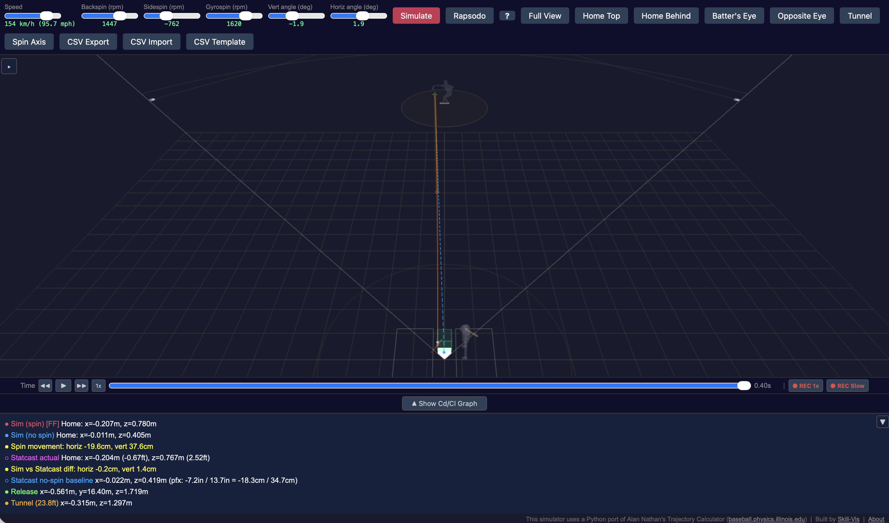

::: {.hero-section}

実際の物理法則に基づいて、投球の3D軌道をブラウザ上でシミュレーションする無料ツールです。
MLB投手を検索し、投球を選んで、ボールが飛んでいく様子を観察できます。

[**シミュレータを開く**](https://baseball.skill-vis.com){.btn .btn-primary .btn-lg target="_blank"}
&nbsp;&nbsp;
[はじめに](getting-started.qmd){.btn .btn-outline-light .btn-lg}

:::

{fig-alt="投球軌道シミュレータ"}

## できること

投手の名前を入力すると、MLB Statcastからその投手の実際の投球データ（フォーシーム、スライダー、カーブ、チェンジアップなど）を取得します。データは**2016年から現在のシーズンまで**利用可能です。投球を選んでSimulateを押すと、ピッチャーの手からホームプレートまでの軌道が3Dで表示されます。

この軌道は映像に基づくアニメーションではありません。**物理シミュレーション**です。リリース速度、回転数、回転軸から、イリノイ大学の[Alan Nathan教授](https://baseball.physics.illinois.edu/)が開発した空気力学モデル — 野球の軌道研究における標準的なリファレンス — を用いて計算しています。

## 活用シーン

::: {.feature-cards}

::: {.feature-card}
### ピッチングコーチ向け
投手のフォーシームとチェンジアップをOverlayして、トンネリングが効果的かどうかを確認。2つの軌道がどこで、いつ分岐するかを正確に見ることができます。
:::

::: {.feature-card}
### アナリスト向け
投手間のスピン分解（バックスピン、サイドスピン、ジャイロスピン）を比較。Season Summary APIで球種別のシーズン通算データやスピン効率を一括取得。完全な軌道データをCSVエクスポートして、さらなる分析が可能です。
:::

::: {.feature-card}
### 選手育成向け
Rapsodoの計測データを直接入力して軌道をシミュレーション。回転数や回転軸を変えた「もしも」のシナリオをテストできます。
:::

:::

## 主な機能

| 機能 | 説明 |
|------|------|
| **MLB Statcast連携** | 投手を検索し、試合ごとの投球データを閲覧、個別の投球をシミュレート |
| **Season Summary API** | 球種別の平均値（球速、回転数、変化量、BSG分解、スピン効率）と月別推移を一括取得 |
| **3つの入力モード** | Statcastデータ、手動スライダー、Rapsodo計測値 |
| **Overlay比較** | 複数の投球を重ね合わせて軌道を比較 |
| **バッター視点** | バッターボックスからの一人称カメラ — 打者が見る景色を体験 |
| **ピッチトンネル** | 打者が判断を迫られるトンネルポイント（23.8フィート）を可視化 |
| **スピン軸表示** | 実際の角速度で回転する縫い目テクスチャ付きボールとスピン軸矢印 |
| **CSVインポート/エクスポート** | 速度、加速度、力の内訳を含む完全な軌道データ |
| **動画録画** | 3Dビューをmp4としてエクスポート |
| **共有リンク** | シミュレーション結果をURLで共有 — リンクを開くだけで同じ投球を再現 |
| **Claude Desktop (MCP)** | 自然言語でStatcastデータの検索やシミュレーションを実行。[セットアップガイド](https://github.com/skill-vis/baseball-mcp-server) |
| **C~L~モデル調整** | Statcastフィッティング済み（cl2=1.045）またはNathanオリジナル（cl2=1.12）を選択可能 |

## 球種一覧

シミュレータはMLB Statcastと同じ球種分類とカラーコードを使用しています：

FF フォーシーム &nbsp;
SI シンカー &nbsp;
FC カッター &nbsp;
SL スライダー &nbsp;
CU カーブ &nbsp;
CH チェンジアップ &nbsp;
FS スプリッター &nbsp;
ST スイーパー

## 物理の仕組み

::: {.callout-note collapse="true" title="詳しく知りたい方へ（オプション）"}

シミュレータは、空気中を進む回転するボールの運動方程式を解いています：

- **抗力（ドラッグ）** — ボールを減速させる（速度に逆らう力）
- **マグナス力** — スピン軸と速度の両方に垂直な方向にボールを押す
- **重力** — ボールを下に引く（g = 9.80 m/s²、MLB球場平均）

スピンは3つの**正規直交**成分に分解されます：

- **バックスピン** — 速度に垂直かつ水平面内の軸周りの回転。「ライズ」を生み出します（重力に抵抗）。バックスピン2200rpmのフォーシームは、スピンなしのボールに比べて約40cm落下が少なくなります。
- **サイドスピン** — 速度とバックスピン軸の両方に垂直な軸周りの回転。水平方向の変化を生みます。
- **ジャイロスピン** — 速度方向周りの回転（弾丸のような回転）。マグナス力には**寄与しません**。ジャイロスピンが多く、バック/サイドスピンが少ない投球は、総回転数が高くても変化が小さくなります。

BSG基底は正規直交系です：**e~b~** = **e~g~** × **e~Z~**（水平面内）、**e~s~** = **e~b~** × **e~g~**。ここで**e~g~**は速度方向、**e~Z~**は鉛直上向き。成分間の漏れがない正確な分解を保証します。

ボールのパラメータはNathanのExcel軌道計算機に準拠：質量 = 5.125 oz、円周 = 9.125 in。

シミュレーションは4次ルンゲ・クッタ法で0.001秒刻みの積分を行っています。
:::

## APIアクセス

シミュレータは公開REST APIを提供しています。主なエンドポイント：

| エンドポイント | 説明 |
|---------------|------|
| `POST /statcast/search` | 投手を名前で検索 |
| `POST /statcast/games` | 投手の年間登板日を取得 |
| `POST /statcast/pitches` | 特定の試合の全投球データを取得 |
| `POST /statcast/simulate` | 軌道シミュレーションを実行 |
| `POST /statcast/season_summary` | シーズン通算の球種別サマリー（BSG分解・月別推移付き） |

APIキー不要。ベースURL: `https://baseball.skill-vis.com`

Claude Desktopからの自然言語アクセスについては[MCPサーバーのセットアップガイド](https://github.com/skill-vis/baseball-mcp-server)をご参照ください。

## クレジット

- 物理モデル: [Alan Nathanの軌道計算機](https://baseball.physics.illinois.edu/)
- 投球データ: [MLB Statcast](https://baseballsavant.mlb.com/)（Hawk-Eyeトラッキング）
- 野球ボールの縫い目曲線: [mathcurve.com](https://mathcurve.com/courbes3d.gb/couture/couture.shtml) のパラメトリック表現
- C~L~モデル較正: 2025年シーズン6投手120球によるフィッティング
